# XAdaptCT: A Deep Learning-based Web Application for CT Reconstruction from X-ray Images

[](https://gwdu.ptit.edu.vn/storage/file/692e56009bcc859dd51c3988/ICTA_2025_295.pdf)
[](https://gwdu.ptit.edu.vn/storage/file/692e56009bcc859dd51c3988/ICTA_2025_295.pdf)
[](https://quocbao2772004.github.io/XAdaptCT/)
[](https://drive.google.com/drive/folders/1WDGgtGz19ZAZEb9CJwuVKyI7n6SmhDOi?usp=sharing)
[](https://www.python.org/)
[](https://pytorch.org/)
[](LICENSE)

An end-to-end deep learning framework and full-stack clinical web application for reconstructing high-fidelity 3D Computed Tomography (CT) volumes directly from a single 2D chest X-ray projection.

---

## 📌 News & Updates
- **[2025]** Project paper accepted at the **International Conference on Advanced Technologies (ICTA 2025)**.
- **[2025]** Released full source code, including **DiffDRR** synthetic data generation, **CycleGAN** domain adaptation, **X-ray2CTPA** 3D diffusion modeling, and the **Clinical Web Application**.

---

## 📖 Overview

Computed Tomography (CT), particularly contrast-enhanced CT Pulmonary Angiography (CTPA), provides vital 3D spatial resolution for diagnosing pulmonary and thoracic diseases. However, CT scans incur significant financial costs, deliver higher ionizing radiation doses, and remain scarce in resource-constrained medical centers. In contrast, 2D chest radiography (X-ray) is cost-effective, low-dose, and globally accessible.

This project introduces an end-to-end AI-driven pipeline that resolves this cross-modal inverse reconstruction challenge:

<p align="center">
  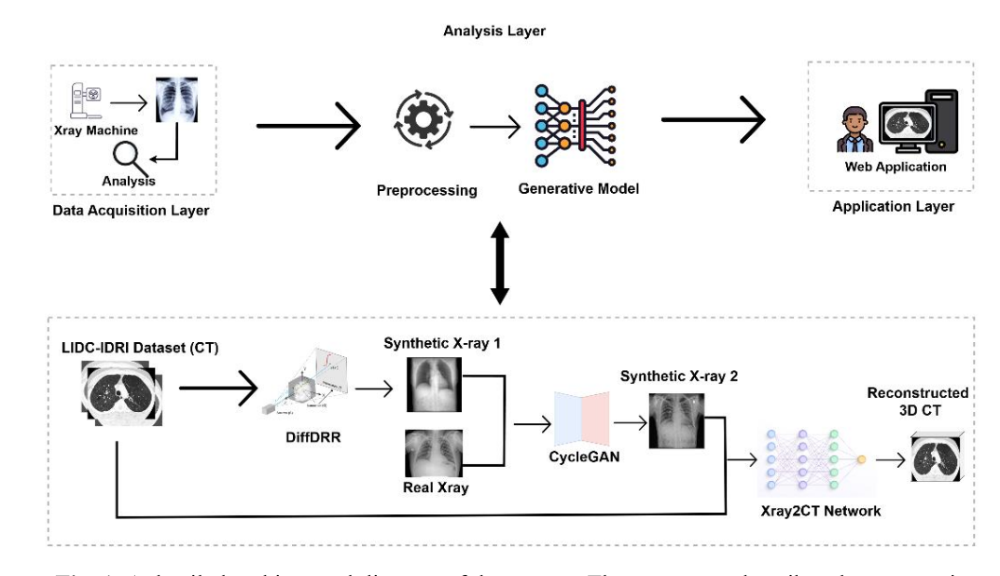
</p>

### Key Contributions
1. **Differentiable Ray-Tracing (DiffDRR)**: Synthesizes clinically calibrated Digitally Reconstructed Radiographs (DRRs) from public 3D CT datasets (LIDC-IDRI, CTPA).
2. **Synthetic-to-Real Domain Adaptation (CycleGAN)**: Mitigates domain shifts between synthetic DRRs and authentic clinical radiographs, ensuring robust transferability.
3. **3D Volumetric Conditional Diffusion (X-ray2CTPA)**: Employs a 3D Variational Autoencoder (VAE) and cross-attention denoising U-Net conditioned on 2D X-ray priors to synthesize coherent 3D anatomical structures.
4. **Full-Stack Clinical Web Application**: Features real-time multi-planar slice reformatting (axial, coronal, sagittal), dynamic slice navigation sliders, and continuous 3D volume rotation.
5. **Modern Academic Project Website**: Scientific project page (`paper/`) designed according to top-tier research standards (A*/Q1 style).

---

## 🧠 Model Architecture

The core reconstruction backbone uses a latent 3D conditional denoising diffusion probabilistic model (DDPM):

<p align="center">
  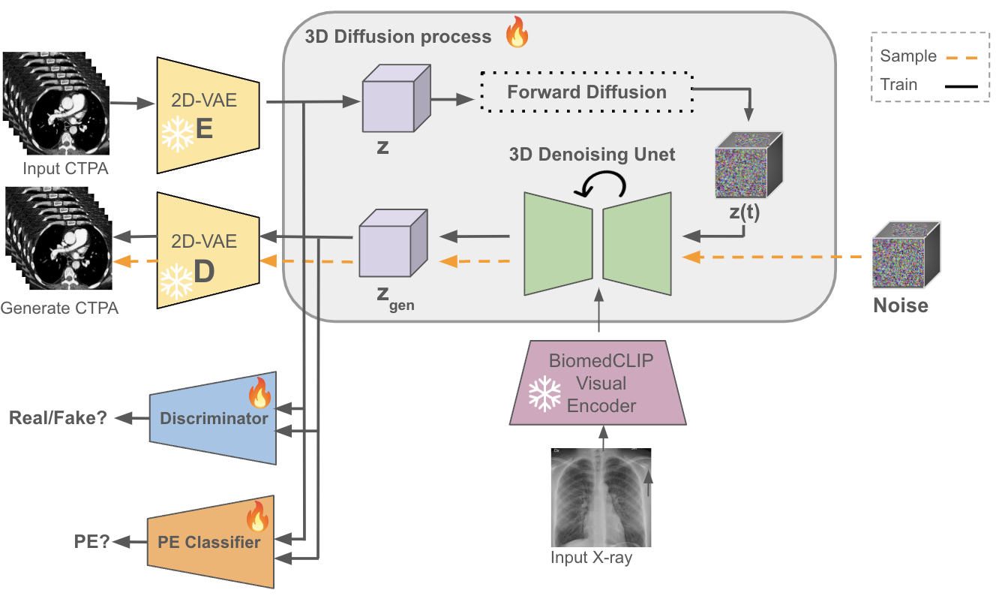
</p>

- **3D VAE Encoder / Decoder**: Compresses dense volumetric CT scans into a compact continuous latent representation to drastically reduce computational overhead.
- **Cross-Attention Conditional U-Net**: Integrates feature embeddings extracted from 2D chest radiographs as conditioning signals to guide the 3D denoising trajectory.

---

## 🔬 Visual Demonstration

Below are sample reconstructions comparing **2D X-Ray Inputs**, **Reconstructed 3D CT Volumes**, and **Ground Truth Reference CTs**:

### 1. CTPA Dataset (Contrast-Enhanced Pulmonary Angiography)
| 2D Chest X-Ray Input | Reconstructed 3D CT (Generated) | Ground Truth CT Reference |
| :---: | :---: | :---: |
| 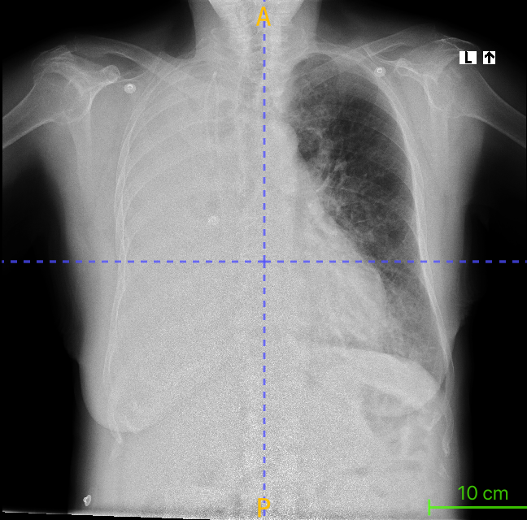 | 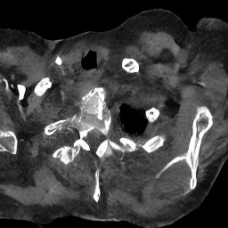 | 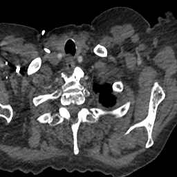 |
| 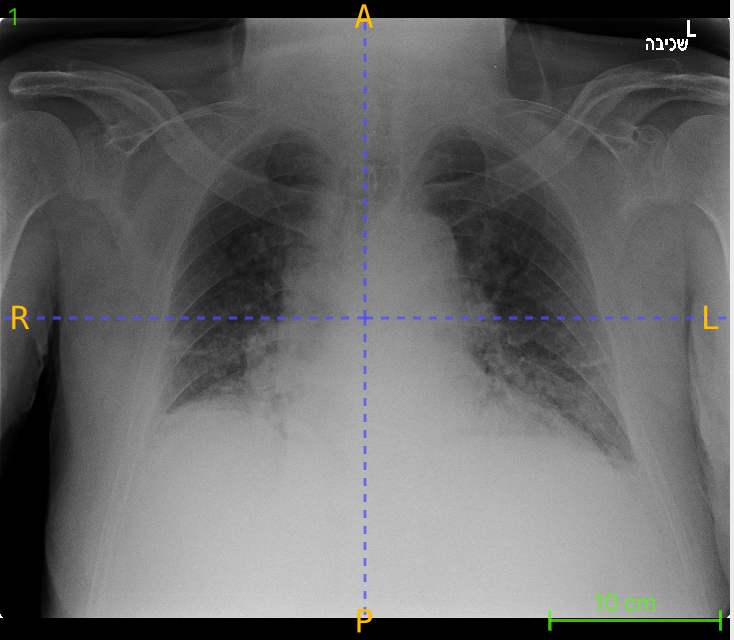 | 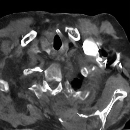 | 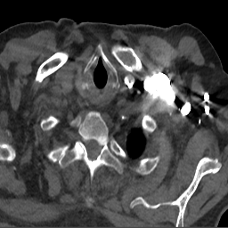 |

### 2. LIDC-IDRI Dataset (Low-Dose Lung CT Benchmark)
| 2D Chest X-Ray Input | Reconstructed 3D CT (Generated) | Ground Truth CT Reference |
| :---: | :---: | :---: |
|  | 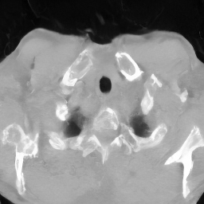 | 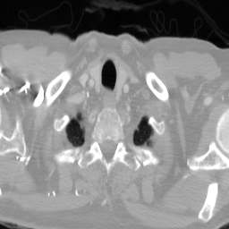 |
| 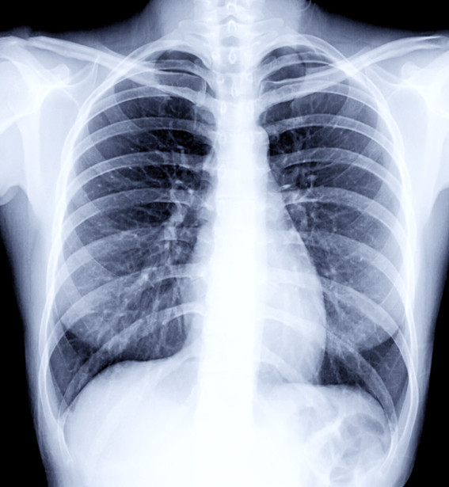 | 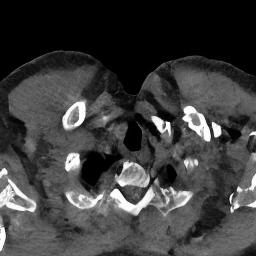 | 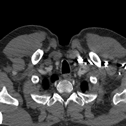 |

---

## 📊 Benchmark Results

Evaluations conducted on held-out test splits (including 10% LIDC-IDRI test set):

| Metric | Score | Description |
| :--- | :---: | :--- |
| **SSIM** | **0.7017** | Structural Similarity Index Measure |
| **PSNR** | **24.79 dB** | Peak Signal-to-Noise Ratio |
| **Inference Mode** | Latent 3D Diffusion | Conditional VAE + U-Net Denoising |

### Qualitative Comparison with Clinical Ground Truth
<p align="center">
  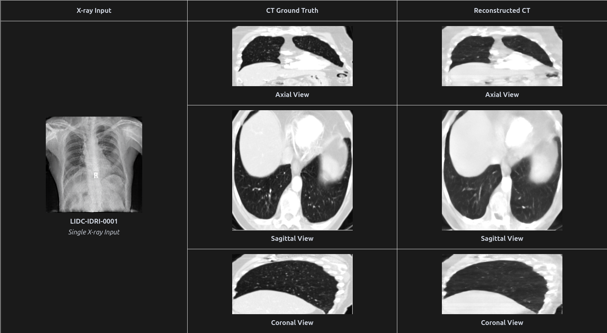
</p>

### Detailed Evaluation Table
<p align="center">
  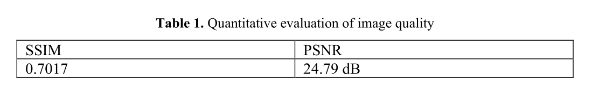
</p>

---

## 💻 Clinical Web Application Interface

Our web interface allows medical professionals to interactively inspect synthesized 3D volumes slice-by-slice across orthogonal anatomical planes:

<p align="center">
  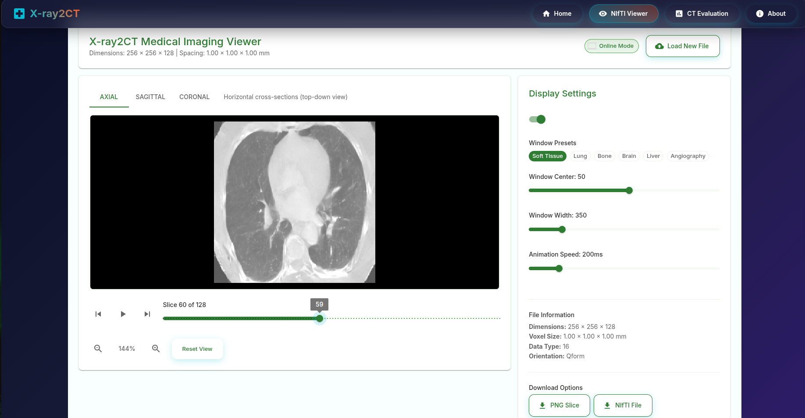
</p>

- **Multi-Planar Reformatting (MPR)**: Synchronized Axial, Coronal, and Sagittal orthogonal cross-sections.
- **Slice Slider Navigation**: Interactive depth exploration of voxel structures.
- **3D Spatial Rotation**: Continuous viewpoint adjustments for comprehensive anatomical assessment.

---

## 📂 Repository Structure

```text
XAdaptCT/
├── DiffDRR/                      # GPU-accelerated differentiable ray-tracing module
├── pytorch-CycleGAN-and-pix2pix/ # Domain adaptation (Synthetic DRR -> Clinical X-Ray)
├── Xray2CTPA/                    # 3D conditional latent diffusion model & training
│   ├── config/                   # Hydra configuration files (dataset, model, train)
│   ├── dataset/                  # PyTorch Dataset loaders (XrayCTPA, XrayLIDC)
│   ├── ddpm/                     # Diffusion probabilistic model implementations
│   ├── preprocess/               # Data normalization and NIfTI preprocessing
│   ├── train/                    # Distributed model training scripts
│   ├── vq_gan_3d/                # 3D VAE / VQ-GAN autoencoders
│   └── inference.py              # Volume inference from 2D radiograph
├── web/                          # Full-stack clinical web application
│   ├── DoAnPtit_Backend/         # FastAPI / Python backend service & database
│   └── DoAnPtit_FrontEnd/        # React / Vite web frontend interface
├── paper/                        # Academic paper project page (web demo)
│   ├── index.html                # Project webpage (SwiftAudio / A* paper style)
│   ├── styles.css                # Minimalist scientific stylesheet
│   └── script.js                 # Interactive demonstration logic & BibTeX copy
├── assets/                       # Figures, animated volume GIFs, and benchmark tables
├── requirements.txt              # Core Python dependencies
└── README.md                     # Project documentation
```

---

## 📦 Pretrained Model Checkpoints

Pretrained model weights for **CycleGAN** (synthetic-to-real domain adaptation) and **X-ray2CTPA** (3D conditional latent diffusion model) are available on Google Drive:

🔗 **[Google Drive Checkpoint Folder (Private)](https://drive.google.com/drive/folders/1WDGgtGz19ZAZEb9CJwuVKyI7n6SmhDOi?usp=sharing)**

| Model Component | Checkpoint File | Description | Target Path in Repository |
| :--- | :--- | :--- | :--- |
| **X-ray2CTPA Diffusion** | `model-81.pt` | 3D Conditional Latent Diffusion Model checkpoint (milestone 81) | `Xray2CTPA/checkpoints/model-81.pt`<br>`web/DoAnPtit_Backend/DoAnPtit_Xray2CT/checkpoints/model-81.pt` |
| **CycleGAN Generator** | `latest_net_G.pth` | Synthetic DRR to real X-ray generator network | `pytorch-CycleGAN-and-pix2pix/checkpoints/xray_cyclegan/latest_net_G.pth`<br>`web/DoAnPtit_Backend/DoAnPtit_CycleGan/checkpoints/xray_cyclegan/latest_net_G.pth` |

> [!NOTE]
> Access to the Google Drive checkpoint folder is private. If you need access to evaluate or test the model checkpoints, please request access or contact the repository owner.

---

## 🚀 Getting Started

### 1. Prerequisites & Environment Setup

Clone the repository and install dependencies:

```bash
git clone https://github.com/quocbao2772004/XAdaptCT.git
cd XAdaptCT

# Create and activate a conda environment
conda create -n xadaptct python=3.9 -y
conda activate xadaptct

# Install dependencies
pip install -r requirements.txt
```

### 2. Training the 3D Diffusion Model

To train the conditional diffusion model with Hydra:

```bash
cd Xray2CTPA
python train/train_ddpm.py \
  model=ddpm \
  dataset=xrayctpa \
  model.vae_ckpt='stabilityai/stable-diffusion-xl-base-1.0' \
  model.results_folder_postfix='lora_finetune' \
  model.diffusion_img_size=32 \
  model.diffusion_depth_size=64 \
  model.diffusion_num_channels=4 \
  model.dim_mults=[1,2,4,8] \
  model.batch_size=10 \
  model.gpus=1
```

### 3. Running the Clinical Web Application

#### Backend Service
```bash
cd web/DoAnPtit_Backend
python -m venv venv
source venv/bin/activate
pip install -r requirements.txt
python setup_database.py
uvicorn app.main:app --host 0.0.0.0 --port 8000 --reload
```

#### Frontend Interface
```bash
cd web/DoAnPtit_FrontEnd
npm install
npm run dev
```
Open [http://localhost:5173](http://localhost:5173) in your browser.

### 4. Viewing the Paper Project Page Locally

Run a lightweight local HTTP server:

```bash
cd XAdaptCT
python3 -m http.server 8080
```
Navigate to [http://localhost:8080/paper/](http://localhost:8080/paper/) to view the academic project page.

---

## 📝 Citation

If you find this work, codebase, or web application useful for your research, please cite our paper:

```bibtex
@inproceedings{xray2ct2025,
  title     = {A Deep Learning-based Web Application for CT Reconstruction from X-ray Image},
  author    = {Nguyen, Huu Quang Hoa and Le, Tran Quoc Bao and Tran, Quy Dat and Nguyen, Thi Tan Tien and Nguyen, Hang Phuong and Tran, Cong and Pham, Cuong},
  booktitle = {Proceedings of the International Conference on Advanced Technologies (ICTA)},
  year      = {2025}
}
```

---

## 👥 Authors & Affiliations

- **Huu Quang Hoa Nguyen**<sup>1,†</sup>
- **Tran Quoc Bao Le**<sup>1,†</sup>
- **Quy Dat Tran**<sup>1,†</sup>
- **Thi Tan Tien Nguyen**<sup>2,3,*</sup>
- **Hang Phuong Nguyen**<sup>4</sup>
- **Cong Tran**<sup>1</sup>
- **Cuong Pham**<sup>1</sup>

<sup>1</sup> *Posts and Telecommunications Institute of Technology (PTIT), Hanoi, Vietnam*  
<sup>2</sup> *Thai Nguyen University of Information and Communication Technology (ICTU), Thai Nguyen, Vietnam*  
<sup>3</sup> *Thai Nguyen University of Medicine and Pharmacy (TUMP), Thai Nguyen, Vietnam*  
<sup>4</sup> *School of Mechanical Engineering, University of Ulsan, Ulsan, Republic of Korea*  

<sup>*</sup> Corresponding author  
<sup>†</sup> Equal contribution

---

## 📄 License
This project is licensed under the [MIT License](LICENSE).
